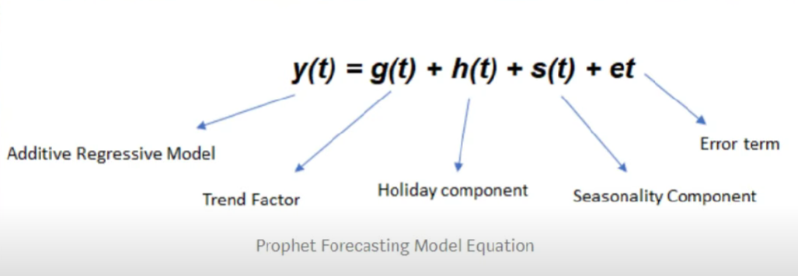
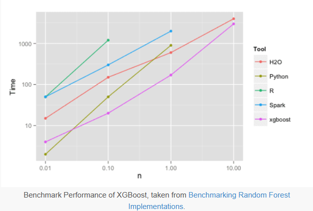

# Các mô hình TSF
## 1. Prophet
Paper: https://peerj.com/preprints/3190/  
Tutorial: https://facebook.github.io/prophet/docs/quick_start.html#python-api
https://github.com/facebook/prophet  
Model (dự báo mức tiêu thụ năng lượng): https://www.kaggle.com/code/robikscube/time-series-forecasting-with-prophet  
Youtube: https://www.youtube.com/watch?v=j0eioK5edqg

### Tổng quan
* Prophet được thiết kế để xử lý dữ liệu chuỗi thời gian có hiệu ứng mùa vụ mạnh mẽ và có thể tính toán các ngày lễ, xu hướng và các thay đổi đột ngột hoặc các giá trị ngoại lai trong dữ liệu. Đặc biệt hữu ích cho các bộ dữ liệu có thể có các giá trị thiếu hoặc không đều.

* Prophet phân rã dữ liệu chuỗi thời gian thành ba thành phần chính: xu hướng, mùa vụ và ngày lễ. Nó sử dụng mô hình cộng hưởng trong đó các thành phần này được kết hợp

### Đánh giá 
* Ưu điểm:
    * Prophet sử dụng phương pháp Bayesian để xử lý sự không chắc chắn trong các thay đổi xu hướng và tác động của các ngày lễ. Nó tương đối dễ sử dụng, người dùng không cần có kiến thức sâu về thống kê hay khoa học dữ liệu
    * Mô hình này tự động xác định và tính toán các thành phần chính của chuỗi thời gian như xu hướng, mùa vụ và ngày lễ.
    * So với các model khác prophet cung cáp trực quan thêm một khoảng giá trị gọi là khoảng tin cậy khi dự báo: giới hạn giá trị predict có thể rơi vào
* Khuyết điểm: 
    * Khả năng dự đoán hạn chế: tham khảo nhiều mô hình với chuỗi thời gian phức tạp thì prophet không hiểu quả chỉ số MSE MAE lớn 
    * Giới hạn bởi các mô hình thực tế: yêu cầu cao với dữ liệu đầu vào để có kết quả tốt, gặp khó khăn khi với chuỗi lớn phức tạp không tuân theo các mẫu cụ thể

## 2. Xgboost
Tutorial:   
link1: https://www.youtube.com/watch?v=vV12dGe_Fho   
link2: https://www.youtube.com/watch?v=K_9G29R01kw&t=1176s   
Model (Bitcoin): https://www.kaggle.com/code/someadityamandal/bitcoin-time-series-forecasting    
Model (Energy): https://www.kaggle.com/code/robikscube/tutorial-time-series-forecasting-with-xgboost    
Git: https://github.com/rohan-paul/MachineLearning-DeepLearning-Code-for-my-YouTube-Channel/tree/master/Time-Series/XGBoost_for_TIme_Series_Dataset_Demand_Forecasting  
Article: https://machinelearningmastery.com/gentle-introduction-xgboost-applied-machine-learning/

### Tổng quan
* XGBoost (eXtreme Gradient Boosting) là một trong những thuật toán máy học phổ biến và mạnh mẽ dành cho cả bài toán phân loại và dự đoán trong học máy.
* Đây là một thuật toán được xây dựng dựa trên kỹ thuật boosting, trong đó các cây quyết định tạo thành chuỗi để giải quyết vấn đề dự đoán. Cây quyết định này được xây dựng tuần tự, mỗi cây sẽ cố gắng cải thiện kết quả của cây trước đó. Công việc của mỗi cây là học từ những sai lệch (residuals) của cây trước đó.

### Đánh giá
* Ưu điểm:  
    * Hiệu suất cao: XGBoost thường cho kết quả tốt trên nhiều loại dữ liệu
    
    * Tốc độ và hiệu quả: XGBoost được tối ưu hóa để chạy nhanh và có thể xử lý các tập dữ liệu lớn.
    https://machinelearningmastery.com/gentle-introduction-xgboost-applied-machine-learning/
* Khuyết điểm:
    * Cần điều chỉnh và lựa chọn các tham số (khá khó đòi hỏi thời gian)
    * Nó tốt nhưng cách tiếp cận không gần gũi như các mô hình ARIMA, SARIMA, ARCH, etc.
