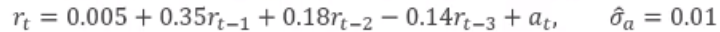
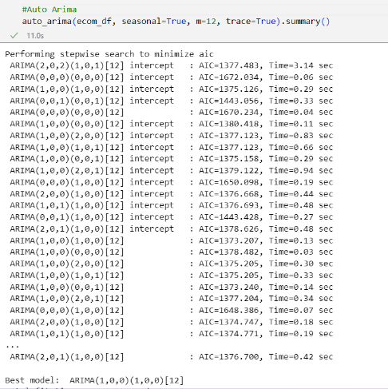

# Các mô hình TSF
## 1. Prophet
Paper: https://peerj.com/preprints/3190/  
Tutorial: https://facebook.github.io/prophet/docs/quick_start.html#python-api
https://github.com/facebook/prophet  
Model (dự báo mức tiêu thụ năng lượng): https://www.kaggle.com/code/robikscube/time-series-forecasting-with-prophet  
Youtube: https://www.youtube.com/watch?v=j0eioK5edqg

### Tổng quan
* Prophet được thiết kế để xử lý dữ liệu chuỗi thời gian có hiệu ứng mùa vụ mạnh mẽ và có thể tính toán các ngày lễ, xu hướng và các thay đổi đột ngột hoặc các giá trị ngoại lai trong dữ liệu. Đặc biệt hữu ích cho các bộ dữ liệu có thể có các giá trị thiếu hoặc không đều.

* Prophet phân rã dữ liệu chuỗi thời gian thành ba thành phần chính: xu hướng, mùa vụ và ngày lễ. Nó sử dụng mô hình cộng hưởng trong đó các thành phần này được kết hợp

### Đánh giá 
* Ưu điểm:
    * Prophet sử dụng phương pháp Bayesian để xử lý sự không chắc chắn trong các thay đổi xu hướng và tác động của các ngày lễ. Nó tương đối dễ sử dụng, người dùng không cần có kiến thức sâu về thống kê hay khoa học dữ liệu
    * Mô hình này tự động xác định và tính toán các thành phần chính của chuỗi thời gian như xu hướng, mùa vụ và ngày lễ.
    * So với các model khác prophet cung cấp trực quan thêm một khoảng giá trị gọi là khoảng tin cậy khi dự báo: giới hạn giá trị predict có thể rơi vào
* Khuyết điểm: 
    * Khả năng dự đoán hạn chế: tham khảo nhiều mô hình với chuỗi thời gian phức tạp thì prophet không hiểu quả chỉ số MSE MAE lớn 
    * Giới hạn bởi các mô hình thực tế: yêu cầu cao với dữ liệu đầu vào để có kết quả tốt, gặp khó khăn khi với chuỗi lớn phức tạp không tuân theo các mẫu cụ thể

## 2. Xgboost
Tutorial:   
link1: https://www.youtube.com/watch?v=vV12dGe_Fho   
link2: https://www.youtube.com/watch?v=K_9G29R01kw&t=1176s   
Model (Bitcoin): https://www.kaggle.com/code/someadityamandal/bitcoin-time-series-forecasting  
Model (Energy): https://www.kaggle.com/code/robikscube/tutorial-time-series-forecasting-with-xgboost  
Git: https://github.com/rohan-paul/MachineLearning-DeepLearning-Code-for-my-YouTube-Channel/tree/master/Time-Series/XGBoost_for_TIme_Series_Dataset_Demand_Forecasting  
Article: https://machinelearningmastery.com/gentle-introduction-xgboost-applied-machine-learning/

### Tổng quan
* XGBoost (eXtreme Gradient Boosting) là một trong những thuật toán máy học phổ biến và mạnh mẽ dành cho cả bài toán phân loại và dự đoán trong học máy.
* Đây là một thuật toán được xây dựng dựa trên kỹ thuật boosting, trong đó các cây quyết định tạo thành chuỗi để giải quyết vấn đề dự đoán. Cây quyết định này được xây dựng tuần tự, mỗi cây sẽ cố gắng cải thiện kết quả của cây trước đó. Công việc của mỗi cây là học từ những sai lệch (residuals) của cây trước đó.

### Đánh giá
* Ưu điểm:  
    * Hiệu suất cao: XGBoost thường cho kết quả tốt trên nhiều loại dữ liệu
    
    * Tốc độ và hiệu quả: XGBoost được tối ưu hóa để chạy nhanh và có thể xử lý các tập dữ liệu lớn.
    https://machinelearningmastery.com/gentle-introduction-xgboost-applied-machine-learning/
* Khuyết điểm:
    * Cần điều chỉnh và lựa chọn các tham số (khá khó đòi hỏi thời gian)
    * Nó tốt nhưng cách tiếp cận không gần gũi như các mô hình ARIMA, SARIMA, ARCH, etc.

# ARCH, GARCH, TARCH

## **ARCH (AutoRegressive Conditional Heteroskedasticity)**  
là một mô hình thường được sử dụng trong phân tích chuỗi thời gian để mô hình hóa phương sai không đồng nhất (heteroskedasticity) trong dữ liệu. 
* **AR**: Tự hồi quy với các biến trễ   
    VD: Tỉ lệ tăng trưởng GNP thực hiện theo quý của Mỹ từ năm 1947 - 1991 
    
  “Tự hồi quy” vì tỷ lệ tăng trưởng của quý này phụ thuộc vào tỷ lệ tăng trưởng của 3 quý trước đó  
    Mô hình ARCH giả định rằng phương sai của một chuỗi thời gian có thể được mô hình hóa dựa trên các giá trị trước đó của chuỗi thời gian đó (được gọi là mô hình autoregressive). Mô hình này phù hợp với các trường hợp khi phương sai của dữ liệu biến đổi theo thời gian hoặc dựa trên điều kiện cụ thể.
* **Heteroskedasticity**:  trong chuỗi thời gian xảy ra khi phương sai của phân phối dữ liệu cơ bản biến đổi theo thời gian. Trong một chuỗi thời gian lý tưởng, chúng ta thường mong đợi rằng phương sai sẽ không thay đổi, tạo ra một mô hình ổn định. Tuy nhiên trong thực tế điều này hiếm khi xảy ra, khi phương sai tăng hoặc giảm theo thời gian, chúng ta gặp phải heteroskedasticity.  
Trong một số trường hợp một số lượng nhỏ của heteroskedasticity có thể được che giấu thông qua các biến đổi dữ liệu (tính sai phân diff, log, Substracting previous value with Shift,...) nhưng khi phương sai không chỉ biến đổi mà còn được điều kiện trên các bước thời gian trước đó, chúng ta gọi đó là conditional heteroskedasticity hoặc volatility clustering. Điều này có thể ảnh hưởng đến khả năng dự đoán và mô hình hóa chuỗi thời gian, đặc biệt trong việc dự báo chỉ số S&P500 và các thị trường tài chính khác.
* **Công thức cơ bản của mô hình ARCH(p) có thể được biểu diễn như sau:**     

        σ²ₜ = α₀ + α₁ * ε²ₜ₋₁ + α₂ * ε²ₜ₋₂ + ... + αₚ * ε²ₜ₋ₚ

    Trong đó:
    - \(σ²ₜ\) là phương sai tại thời điểm \(t\),
    - \(α₀, α₁, ..., αₚ\) là các tham số mô hình cần ước lượng,
    - \(ε²ₜ₋₁, ε²ₜ₋₂, ..., ε²ₜ₋ₚ\) là bình phương của các giá trị sai số tại các thời điểm trước đó.
* **Xác định các hệ số (p, d, q):**  
    Theo Box-Jenkin:  
    | AR(p) | MA(q) | ARMA(p,q) | ARIMA(p,d,q) |
    |-------|-------|-----------|--------------|
    |Xác định p dựa vào đồ thị PACF |Xác định q dựa và ACF|Xác định p, q dựa vào PACF, ACF| Xác định p, q dựa vào PACF, ACF. Sai phân => d |  
    |<td colspan="4"> Chọn mô hình phù hợp với tiêu chí AIC, BIC, SC nhỏ nhất  </td>     |
    
    VD:    
  
    
    Tại sao lại chọn hệ số dựa vào PACF, ACF?  
    -> PACF, ACF là những hàm tương quan nó thể hiện mức độ tương quan giữa biến hiện tại tới các lag trong quá khứ -> chọn những lag có PACF ACF lớn (nằm ngoài mức)

=> Tóm gọn khác với mô hình AR bình thường sử dụng các giá trị trước đó để dự báo giá trị hiện tại. Trong ARCH  phương sai của bước thời gian hiện tại phụ thuộc vào p giá trị trễ bình phương của sai số chuẩn, với các hệ số α.

## **GARCH (Generalized Autoregressive Conditional Heteroskedasticity)**
* GARCH mở rộng từ ARCH bằng cách cho phép phương sai phụ thuộc vào các trễ của chính nó và các trễ của bình phương dư thừa. GARCH có khả năng bắt được những biến đổi lớn như tăng và giảm đột ngột của biến động.

* Công thức cho mô hình GARCH mô tả phương sai tại thời điểm 't' dựa trên các lỗi bình phương trễ và phương sai có điều kiện trễ:

      σ²t = α₀ + α₁u²t₋₁ + α₂u²t₋₂ + ... + αₚu²t₋ₚ + β₁σ²t₋₁ + ... + β_q*σ²*t₋q

* Các tham số 'q' và 'p' trong GARCH(q, p) biểu thị:

    - q: Số lượng các trễ phương sai.
    - p: Số lượng các lỗi dư thừa trễ.

* Đánh giá: Mô hình GARCH thường được coi là ưu việt hơn so với mô hình ARCH khi xử lý sự không đồng nhất về phương sai và gom cụm biến động, bởi vì nó có thể bắt được một phạm vi rộng hơn của các biểu hiện biến động. Tuy nhiên, có nhiều biến thể của mô hình GARCH giới thiệu thêm các tham số để tính toán các hành vi cụ thể của biến động, cung cấp sự linh hoạt và độ chính xác cao hơn trong việc mô hình hoá các mẫu biến động phức tạp trong dữ liệu chuỗi thời gian tài chính.

=> Để dự báo thị trường tài chính, chúng ta thường sử dụng các mô hình ARCH và GARCH sau khi áp dụng một mô hình khác như ARIMA trước đó

​
  
